# Invoice Detail Data Flow

This document explains how `/invest/[id]` loads, transforms, and renders an
invoice — from the initial route params all the way to the interactive client
islands displayed to the user.

For the broader architecture context see
[`docs/architecture.md`](architecture.md).  
For the invoice object shape see [`docs/invoice-data.md`](invoice-data.md).  
For the marketplace list flow (the page that links here) see
[`docs/marketplace-data-flow.md`](marketplace-data-flow.md).

---

## Data Flow Diagram

```mermaid
graph TD
    %% ── Entry ──────────────────────────────────────────────────────────────
    subgraph Entry ["1. Route Entry (Next.js App Router)"]
        NavLink[User navigates to /invest/:id]
        NavLink --> RSC[app/invest/&#91;id&#93;/page.js\nServer Component]
        RSC --> AwaitParams["await Promise.resolve(params)\n(supports sync & async Next.js forms)"]
        AwaitParams --> Lookup["getInvoiceById(id)\napp/invest/lib.js  —  sync, mock layer"]
        Lookup -->|"invoice found"| Transform
        Lookup -->|"id unknown"| NotFound["notFound()\n→ app/invest/&#91;id&#93;/not-found.js"]
    end

    %% ── Transform ──────────────────────────────────────────────────────────
    subgraph Transform ["2. Server-Side Transform (runs in RSC, never ships to browser)"]
        Transform["Transform Phase"]
        Transform --> FmtCurrency["formatCurrency(invoice.amount, { currency })\nlib/format/currency.js"]
        Transform --> FmtYield["formatYield(invoice.yield)\nformatAmount() + '%' suffix"]
        Transform --> JsonLD["buildInvoiceJsonLd(invoice)\nSanitised Offer schema.org blob"]
        Transform --> DetailItems["buildInvoiceDetailItems(invoice)\nInvoiceDetailItems.jsx — 3 document rows"]
    end

    %% ── Render ─────────────────────────────────────────────────────────────
    subgraph Render ["3. RSC Render — streams HTML, passes props to client islands"]
        FmtCurrency & FmtYield & JsonLD & DetailItems --> Shell["page.js renders layout shell\n(heading, back-link, JSON-LD &lt;script&gt;)"]

        Shell --> Island1["&lt;InvoiceDetailClient /&gt;\n'use client' — density toggle + metadata\n+ EditableRow inline-edit"]
        Shell --> Island2["&lt;InvoiceDetailItems /&gt;\n'use client' — bulk-select document list"]
        Shell --> Island3["&lt;FundActions /&gt;\n'use client' — fund / copy / print controls"]
        Shell --> Island4["&lt;InvoiceTimeline /&gt;\nServer-rendered status timeline"]
    end

    %% ── Client Hydration ───────────────────────────────────────────────────
    subgraph Hydrate ["4. Client-Side Hydration &amp; Interaction"]
        Island1 --> Density["useDensity()\n← localStorage compact/comfortable"]
        Island1 --> InlineEdit["EditableRow\nview ↔ edit mode\nEsc=cancel · Enter=save\naria-live announcements"]

        Island2 --> BulkSel["useBulkSelection(items)\ntri-state select-all\nExport JSON · Delete w/ ConfirmDialog"]

        Island3 --> Wallet["useWallet()\nfrom WalletProvider\nDISCONNECTED / CONNECTING / CONNECTED / NO_WALLET"]
        Island3 --> Marketplace["useMarketplace()\nfrom MarketplaceContext\npendingIds Set · fundInvoice()"]

        Marketplace --> OptimisticFund["MarketplaceContext.fundInvoice()\n→ useMarketplaceActions.fund()\n  1. snapshot current invoice\n  2. flip status to Funded instantly\n  3. await performAction()\n  4a. success: commit\n  4b. failure: rollback + re-throw"]

        OptimisticFund --> FundAPI["lib/api/fundInvoice.js\nPOST /invoices/:id/fund\n(mock phase → real Soroban TX later)"]
        FundAPI -->|"{ success, txHash }"| Toast["toast.success()\n+ aria-live announcement"]
        FundAPI -->|"FundInvoiceError"| Rollback["toast.error()\n+ aria-live announcement\n+ revert invoice status"]
    end

    %% ── Shared providers (always mounted above this route) ─────────────────
    subgraph Providers ["Shared Providers  (app/layout.js + app/invest/layout.js)"]
        ToastProvider["&lt;ToastProvider&gt;\nuseToast()"]
        WalletProvider["&lt;WalletProvider&gt;\nuseWallet()"]
        MarketplaceShell["&lt;MarketplaceShell&gt;\n&lt;MarketplaceProvider invoices setInvoices&gt;"]
    end

    Wallet -.-> WalletProvider
    Marketplace -.-> MarketplaceShell
    Toast -.-> ToastProvider
    Rollback -.-> ToastProvider

    style Entry fill:#172554,stroke:#1e40af,stroke-width:2px,color:#fff
    style Transform fill:#14532d,stroke:#15803d,stroke-width:2px,color:#fff
    style Render fill:#1e1b4b,stroke:#4338ca,stroke-width:2px,color:#fff
    style Hydrate fill:#0f172a,stroke:#334155,stroke-width:2px,color:#fff
    style Providers fill:#3b1f1f,stroke:#7f1d1d,stroke-width:2px,color:#fff
```



---

## ASCII Flow Overview

A condensed view of the same pipeline for quick reference:

```text
User navigates to /invest/:id
            │
            ▼
┌──────────────────────────────────────────────────────────────┐
│  Server Component — app/invest/[id]/page.js                  │
│                                                              │
│  1. await Promise.resolve(params)  ← supports sync / async  │
│  2. getInvoiceById(id)             ← app/invest/lib.js       │
│         │                                                    │
│    ┌────┴─────┐                                              │
│    ▼          ▼                                              │
│  found     not found ──► notFound() → not-found.js boundary │
│    │                                                         │
│  3. Server-Side Transform (never sent to browser)           │
│     ├── formatCurrency(amount, { currency })                 │
│     ├── formatYield(yield)                                   │
│     ├── buildInvoiceJsonLd(invoice)   ← sanitised JSON-LD   │
│     └── buildInvoiceDetailItems(invoice) ← 3 doc rows       │
│                                                              │
│  4. RSC renders HTML shell + props for client islands        │
└──────────────┬───────────────────────────────────────────────┘
               │  streams HTML to browser
               ▼
┌──────────────────────────────────────────────────────────────┐
│  Layout shell                                                │
│  ├── JSON-LD <script type="application/ld+json">            │
│  ├── Back-link + h1 heading + subtitle                       │
│  │                                                           │
│  ├── <InvoiceDetailClient />      ← "use client"            │
│  │    ├── useDensity()  (localStorage)                       │
│  │    ├── DensityToggle (compact / comfortable)              │
│  │    └── EditableRow × 4  (issuer, amount, yield, dueDate) │
│  │         └── view mode → edit mode on click               │
│  │              Esc=cancel · Enter=save · aria-live          │
│  │                                                           │
│  ├── <InvoiceDetailItems />       ← "use client"            │
│  │    ├── useBulkSelection()                                 │
│  │    ├── BulkActionsToolbar (select-all, export, delete)   │
│  │    └── ConfirmDialog (gating destructive delete)          │
│  │                                                           │
│  ├── <InvoiceTimeline />          ← server-rendered          │
│  │                                                           │
│  └── <FundActions />              ← "use client"            │
│       ├── useWallet()             (WalletProvider)           │
│       ├── useMarketplace()        (MarketplaceContext)       │
│       ├── FundAmountInput  ──► handleFundAmount(amount)      │
│       │                             │                        │
│       │              ┌──────────────┘                        │
│       │              ▼                                       │
│       │   MarketplaceContext.fundInvoice()                   │
│       │    ├── optimistic: flip invoice.status → "Funded"   │
│       │    ├── await performAction(invoiceId, amount)        │
│       │    │      └── lib/api/fundInvoice.js                │
│       │    │           POST /invoices/:id/fund               │
│       │    │                                                 │
│       │    ├── success → commit optimistic state             │
│       │    │             toast.success() + aria-live         │
│       │    └── failure → rollback to previous status         │
│       │                  toast.error()  + aria-live          │
│       │                                                      │
│       ├── Copy link → Clipboard API / textarea fallback      │
│       └── Print    → window.print()                          │
└──────────────────────────────────────────────────────────────┘
```

---

## Detailed Phases

### 1. Route Entry

`app/invest/[id]/page.js` is a **Server Component** — it contains no browser
APIs and no React hooks. Next.js App Router passes a `params` object (or, in
future Next.js versions, a `Promise<params>`) with the dynamic segment `id`.

The component does:

```js
const { id } = await Promise.resolve(params); // supports sync + async forms
const invoice = getInvoiceById(id);            // synchronous mock lookup
if (!invoice) notFound();                      // triggers not-found.js boundary
```

`getInvoiceById` is a synchronous array lookup in `MOCK_INVOICES` from
`app/invest/lib.js`.  Once a live `GET /invoices/:id` endpoint exists the only
change needed here is replacing `getInvoiceById` with an async fetch client (see
[`docs/invoice-data.md`](invoice-data.md) for the migration checklist).

### 2. Server-Side Transform

All formatting runs on the server before any bytes leave the server, so
formatting helpers never appear in the browser JS bundle:

| Helper | Input | Output |
|---|---|---|
| `formatCurrency(amount, { currency })` | `"12,500"`, `"USD"` | `"$12,500"` |
| `formatYield(yield)` | `"8.2%"` | `"8.2%"` (passthrough after validation) |
| `buildInvoiceJsonLd(invoice)` | Full invoice object | `schema.org/Offer` JSON-LD blob |
| `buildInvoiceDetailItems(invoice)` | `{ id, issuer }` | 3 document rows (PDF, PoD, terms) |

`buildInvoiceJsonLd` runs `sanitizeText()` on every field before inserting it
into the `<script dangerouslySetInnerHTML>` tag, stripping `< > { } " '`
characters to prevent XSS through the JSON-LD context.

### 3. RSC Render — Client Islands

The page shell streams static HTML and hands pre-formatted props to three client
islands.  Each island is as small as possible so the minimum JavaScript reaches
the browser:

| Island | Purpose | Key hook |
|---|---|---|
| `InvoiceDetailClient` | Density toggle + metadata + inline edit | `useDensity()` |
| `InvoiceDetailItems` | Bulk-selectable document list | `useBulkSelection()` |
| `FundActions` | Fund / copy-link / print | `useWallet()`, `useMarketplace()` |
| `InvoiceTimeline` | Status lifecycle (server-rendered) | — |

### 4. Client-Side Hydration and Interaction

#### InvoiceDetailClient — density & inline edit

`useDensity()` reads the stored preference from `localStorage` on mount (key
`ui.density`).  The section gets a `data-density` attribute and CSS utility
classes (`p-6 gap-4` for comfortable, `p-4 gap-2` for compact).

Each editable row (`EditableRow`) begins in view mode.  Clicking **Edit**
replaces the `<dd>` value with an `<input>` and Save / Cancel buttons.
Keyboard shortcuts: **Escape** cancels, **Enter** saves (non-date fields only).
Validation errors and save confirmations are announced via a single shared
`role="status" aria-live="polite"` region so screen readers receive one
announcement at a time.

#### FundActions — optimistic fund flow

```text
handleFundAmount(amount)
    │
    ├── wallet DISCONNECTED? → connect(), return early
    │
    └── MarketplaceContext.fundInvoice(id, amount, performAction)
             │
             ├── useMarketplaceActions.fund(id, amount, performAction, { optimisticUpdate, rollback })
             │
             ├── optimisticUpdate: snapshot invoice, flip status → "Funded" in list state
             ├── add id to pendingIds Set  (disables button immediately)
             │
             ├── await performAction(id, amount)
             │       └── lib/api/fundInvoice.js
             │            POST ${NEXT_PUBLIC_API_URL}/invoices/:id/fund
             │            { amount, currency }
             │
             ├── SUCCESS → remove from pendingIds, commit status
             │             toast.success()
             │             aria-live announces result (250 ms debounce)
             │
             └── FAILURE → rollback: restore snapshot in list state
                           remove from pendingIds
                           toast.error()
                           aria-live announces error (250 ms debounce)
```

The `pendingIds` Set is owned by `useMarketplaceActions` and shared via
`MarketplaceContext`.  Because the context wraps both `/invest` and
`/invest/[id]` (mounted in `app/invest/layout.js` via `MarketplaceShell`), an
optimistic status flip on the detail page is immediately visible when the user
navigates back to the marketplace list without a full page reload.

#### Concurrent-action guard

`useMarketplaceActions` uses a `useRef`-based `inFlight` set.  If `fundInvoice`
is called while an action for the same invoice id is already in-flight the call
returns `false` immediately, leaving the submit button disabled.  A re-render is
not needed to enforce this guard.

#### Copy link & Print

- **Copy link**: builds `${window.location.origin}/invest/:id`, writes via
  `navigator.clipboard.writeText` with a `document.execCommand("copy")`
  textarea fallback for older browsers. Result announced via the debounced
  `aria-live` region.
- **Print**: calls `window.print()`. Interactive elements carry `.no-print`;
  the invoice metadata section carries `.print-invoice-section` so only the
  printable content is visible.

---

## Key Files

| File | Role |
|---|---|
| `app/invest/[id]/page.js` | RSC shell: fetch, transform, render |
| `app/invest/lib.js` | Mock data: `MOCK_INVOICES`, `getInvoiceById` |
| `app/invest/[id]/InvoiceDetailClient.jsx` | Client island: density + metadata + inline edit |
| `app/invest/[id]/InvoiceDetailItems.jsx` | Client island: bulk-select document list |
| `app/invest/[id]/FundActions.jsx` | Client island: fund / copy / print |
| `app/invest/MarketplaceContext.jsx` | Shared invoice list state + optimistic `fundInvoice` |
| `app/invest/MarketplaceShell.jsx` | Mounts `MarketplaceProvider` for the `/invest` layout |
| `lib/hooks/useMarketplaceActions.js` | Optimistic action tracker: `pendingIds`, concurrent guard |
| `lib/hooks/useOptimisticFund.js` | Per-invoice fund state machine (idle→pending→confirmed|rolled_back) |
| `lib/api/fundInvoice.js` | HTTP seam: `POST /invoices/:id/fund`, error hierarchy |
| `lib/format/currency.js` | `formatCurrency`, `formatAmount`, `INVALID_VALUE_FALLBACK` |

---

## Notes for New Contributors

- **Do not add formatting logic to client components.** All display formatting
  runs in `page.js` (server side) and is passed as string props to the client
  islands.
- **The mock data layer is temporary.** The detail route still calls
  `getInvoiceById()` from `app/invest/lib.js`.  Once a live `GET /invoices/:id`
  endpoint exists, replace that call with a fetch client and retire the mock
  (see [`docs/invoice-data.md`](invoice-data.md)).
- **`fundInvoice` in `lib/api/fundInvoice.js` is also mocked.** The
  `_executeFundRequest` function currently calls a real `fetch`, but the mock
  server at `localhost:3001` just returns a synthetic `txHash`.  Replace with
  a Stellar/Soroban contract invocation once the backend is wired.
- **Tests inject everything.** The `loadInvoices` prop on `InvestMarketplace`
  and the `performFund` prop on `FundActions` are the testability seams — pass
  mock functions rather than patching global state.
