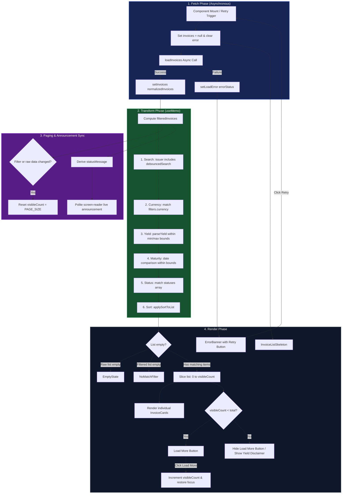

# Marketplace Data Flow

This document details the data lifecycle—from fetching raw invoices to rendering them with filters, sorting, pagination, and accessibility support—within the LiquiFact Marketplace (`/invest` page).

---

## Data Flow Diagram



---

## Textual / ASCII Flow Overview

Here is a simplified ASCII diagram detailing how data moves through the core state machinery:

```text
[ Trigger: Mount / Retry ]
            │
            ▼
┌──────────────────────┐
│  loadInvoices()      │  <── Source: lib.js (Mock) or lib/api/invoices.js (Live API)
└──────────┬───────────┘
           │
     ┌─────┴─────┐
     ▼           ▼
 [Success]   [Failure]
     │           │
     │           └─► setLoadError(error) ────► [ Render: ErrorBanner ]
     ▼
 setInvoices(data)
     │
     ▼
┌──────────────────────────────────────────────────────────────────────────────┐
│  Transform (useMemo)                                                         │
│                                                                              │
│  1. Search: Filter issuers matching debouncedSearch                          │
│  2. Currency: Filter matching filters.currency                               │
│  3. Yield: Filter using parseYield() and yieldMin/yieldMax                   │
│  4. Maturity: Filter using dueDate comparison and maturityFrom/maturityTo    │
│  5. Statuses: Filter matching chosen status flags                            │
│  6. Sort: Sort using applySortToList() on selected column and direction      │
└──────────────────────────────────────┬───────────────────────────────────────┘
                                       │
                                 filteredInvoices
                                       │
                                 ┌─────┴─────┐
                                 ▼           ▼
                      [ Paging State ]    [ Accessibility Announcement ]
                                 │           │
                                 ▼           ▼
                      Slice 0..visibleCount  Compute statusMessage
                                 │           │
                                 ▼           ▼
                      [ Render List View ]  [ aria-live="polite" div ]
```

---

## Detailed Phases

### 1. Data Fetching Phase

The data fetching sequence is managed inside a `useEffect` hook in `app/invest/page.js`.

- **Initiation**: The effect is clean and triggered only when the component mounts or when the `retryKey` state changes. The `retryKey` is bumped by the retry button in the `ErrorBanner` component when a load fails.
- **Safety and Cleanup**: The fetch operation instantiates an `AbortController`. If the component unmounts or a retry is triggered before the promise resolves, the request is aborted and further `setState` updates are prevented.
- **Data Normalization**: The async loader (either `loadMockInvoices` or `fetchInvestableInvoices`) returns the invoices list, which is then normalized into the standard UI contract:
  ```json
  {
    "id": "string",
    "issuer": "string",
    "amount": "string",
    "currency": "string",
    "dueDate": "string (YYYY-MM-DD)",
    "yield": "string",
    "status": "string"
  }
  ```

### 2. Data Transformation Phase

Once raw data settles in the local `invoices` state, a `useMemo` block handles filtering and sorting, caching results unless input data, filters, or search queries change.

*   **Debounced Search Filter**: A local input query is debounced to avoid recalculation on every keystroke. It matches the search query against the invoice `issuer` field in a case-insensitive manner.
*   **Currency & Bounds Filters**: Values are filtered against specific currency constraints and maturity bounds. Minimum/maximum yield parameters are compared dynamically using the `parseYield` helper.
*   **Sorting (`applySortToList`)**: The sorted list is generated by sorting the matching records by:
    *   `amount` (parsed via `parseAmount` helper to handle comma separators)
    *   `yield` (parsed via `parseYield` helper to strip percent symbols)
    *   `maturity` (using direct Date conversions of `dueDate` ISO strings)

### 3. State Synchronizations

To provide a seamless experience, state synchronizations are handled reactively during render:

*   **Paging Reset**: If a user is on page 3 and then filters the list, we must not keep showing page 3 of the new list. The component checks the `filterSignature` (`JSON.stringify([debouncedSearch, filters])`) and the raw `invoices` state during render. If either has changed, `visibleCount` is automatically reset to `PAGE_SIZE` so the user is brought back to the top of the newly filtered list without cascading `useEffect` renders.
*   **Accessibility status region**: Screen readers are updated on every load, filter, and pagination event using the reactive `statusMessage` computed from current states:
    *   **Loading/Error**: Clear or report status message.
    *   **Filtered state**: Announce `{matched}` of `{total}` matching items.
    *   **Initial load**: Announce `{count}` loaded.
    *   **Paginated state**: Announce showing `{shown}` of `{total}`.

### 4. Render Phase

The page evaluates conditions sequentially to display the appropriate state:

1.  **Skeleton State (`invoices === null && !loadError`)**: Displays `InvoiceListSkeleton`.
2.  **Error State (`loadError` is not empty)**: Displays the `ErrorBanner` retry layout.
3.  **Empty State (`invoices.length === 0`)**: Renders the repository empty fallback copy.
4.  **No Matches (`filteredInvoices.length === 0`)**: Shows the filtered empty state.
5.  **Active List View**:
    *   Slices the computed `filteredInvoices` to match the current `visibleCount`.
    *   Maps each active item to a list item containing `InvoiceCard` information.
    *   If more items remain to be shown, a "Load more" button is appended. When clicked, it increments `visibleCount` and returns the focus to the button.
