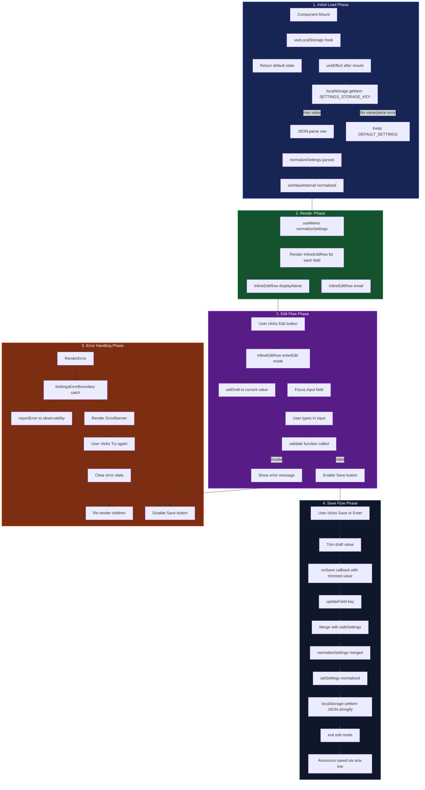

# Settings Data Flow

This document details the data lifecycle for settings—from initial load through editing, validation, persistence, and rendering—within the LiquiFact Settings system (`/settings` page).

**Related docs:**
- [`docs/settings-api.md`](settings-api.md) — component API reference
- [`docs/accessibility.md`](accessibility.md) — accessibility considerations

---

## Data Flow Diagram



---

## Textual / ASCII Flow Overview

Here is a simplified ASCII diagram detailing how data moves through the settings system:

```text
[ Component Mount ]
        │
        ▼
┌─────────────────────────────────────────────────────────────────┐
│  1. Initial Load (useLocalStorage)                              │
│                                                                  │
│  useLocalStorage(SETTINGS_STORAGE_KEY, DEFAULT_SETTINGS)        │
│    ├─ Initial render: return DEFAULT_SETTINGS                   │
│    │   { displayName: "", email: "" }                           │
│    │                                                             │
│    └─ useEffect after mount:                                    │
│        ├─ localStorage.getItem("liquifact-settings-v1")          │
│        ├─ JSON.parse(raw) OR catch → keep default               │
│        ├─ normalizeSettings(parsed)                              │
│        │   ├─ Ensure object structure                           │
│        │   ├─ Fill missing fields with defaults                 │
│        │   └─ Type-check each field                             │
│        └─ setValueInternal(normalized)                           │
└─────────────────────────────────────────────────────────────────┘
        │
        ▼
┌─────────────────────────────────────────────────────────────────┐
│  2. Render (SettingsPage)                                        │
│                                                                  │
│  useMemo(() => normalizeSettings(settings))                      │
│    └─ safeSettings: guaranteed complete shape                    │
│                                                                  │
│  Render InlineEditRow for each field:                            │
│    ├─ InlineEditRow displayName                                  │
│    │   ├─ value: safeSettings.displayName                       │
│    │   ├─ validate: validateDisplayName                         │
│    │   └─ onSave: updateField("displayName")                    │
│    │                                                             │
│    └─ InlineEditRow email                                       │
│        ├─ value: safeSettings.email                            │
│        ├─ validate: validateEmail                               │
│        └─ onSave: updateField("email")                          │
└─────────────────────────────────────────────────────────────────┘
        │
        ▼
┌─────────────────────────────────────────────────────────────────┐
│  3. Edit Flow (InlineEditRow)                                   │
│                                                                  │
│  User clicks Edit button                                        │
│    ├─ enterEdit()                                               │
│    ├─ setDraft(value)                                           │
│    ├─ setIsEditing(true)                                        │
│    └─ focusInput() → input.focus() + input.select()              │
│                                                                  │
│  User types in input                                            │
│    ├─ setDraft(e.target.value)                                  │
│    ├─ validate(draft) called on every keystroke                 │
│    │   ├─ validateDisplayName:                                 │
│    │   │   ├─ Required check (not empty)                        │
│    │   │   ├─ Min length check (≥ 2 chars)                      │
│    │   │   └─ Max length check (≤ 100 chars)                    │
│    │   │                                                         │
│    │   └─ validateEmail:                                        │
│    │       ├─ Required check (not empty)                        │
│    │       ├─ Max length check (≤ 254 chars)                    │
│    │       └─ Email format regex check                          │
│    │                                                             │
│    ├─ error = validate result (null or string)                  │
│    └─ Save button disabled if error !== null                    │
└─────────────────────────────────────────────────────────────────┘
        │
        ▼
┌─────────────────────────────────────────────────────────────────┐
│  4. Save Flow                                                   │
│                                                                  │
│  User clicks Save or presses Enter                              │
│    ├─ save()                                                    │
│    ├─ Check isInvalid (defensive guard)                         │
│    ├─ onSave(trimmedDraft)                                      │
│    │                                                             │
│  updateField(key) callback:                                     │
│    ├─ Merge new value with safeSettings                         │
│    ├─ normalizeSettings(merged)                                 │
│    └─ setSettings(normalized)                                   │
│                                                                  │
│  useLocalStorage setter:                                        │
│    ├─ setValueInternal(computed)                                │
│    ├─ localStorage.setItem(key, JSON.stringify(computed))        │
│    └─ Catch write errors (quota, private mode)                  │
│                                                                  │
│  InlineEditRow cleanup:                                         │
│    ├─ setIsEditing(false)                                       │
│    ├─ setAnnouncement(savedAnnouncement)                        │
│    └─ focus editButtonRef                                       │
│                                                                  │
│  aria-live region announces: "Display name saved"               │
└─────────────────────────────────────────────────────────────────┘
        │
        ▼
┌─────────────────────────────────────────────────────────────────┐
│  5. Error Handling                                              │
│                                                                  │
│  Validation errors:                                              │
│    ├─ Show error message below input                            │
│    ├─ role="alert" aria-live="polite"                           │
│    └─ Disable Save button                                       │
│                                                                  │
│  Runtime errors (SettingsErrorBoundary):                        │
│    ├─ getDerivedStateFromError(error)                           │
│    ├─ componentDidCatch → reportError()                          │
│    ├─ Render ErrorBanner with retry button                      │
│    └─ On retry: clear error, re-render children                 │
│                                                                  │
│  Storage errors:                                                 │
│    ├─ JSON.parse errors → keep default                          │
│    ├─ localStorage.getItem errors → keep default                │
│    └─ localStorage.setItem errors → silent, keep UI working     │
└─────────────────────────────────────────────────────────────────┘
```

---

## Detailed Phases

### 1. Initial Load Phase

The settings page uses the `useLocalStorage` hook for SSR-safe persistence.

**SSR safety:**
- Initial render always returns the default value (`DEFAULT_SETTINGS`)
- This ensures server and client render identically (no hydration mismatch)
- Actual storage read happens in `useEffect` after mount

**Storage read sequence:**
```javascript
useEffect(() => {
  const raw = localStorage.getItem(SETTINGS_STORAGE_KEY);
  if (raw === null) return; // No stored value
  const parsed = JSON.parse(raw);
  setValueInternal(parsed);
}, [key]);
```

**Normalization:**
```javascript
function normalizeSettings(raw) {
  if (!raw || typeof raw !== "object") return { ...DEFAULT_SETTINGS };
  return {
    displayName: typeof raw.displayName === "string" ? raw.displayName : DEFAULT_SETTINGS.displayName,
    email: typeof raw.email === "string" ? raw.email : DEFAULT_SETTINGS.email,
  };
}
```

**Error handling:**
- JSON parse errors are caught silently
- Invalid objects fall back to defaults
- Missing fields are filled with defaults
- Extra/unknown fields are ignored (schema evolution safe)

### 2. Render Phase

The page renders two `InlineEditRow` components for user-editable fields.

**Field configuration:**

| Field | Type | Validator | Max Length | Placeholder |
|-------|------|-----------|------------|-------------|
| `displayName` | text | `validateDisplayName` | 100 | "Your display name" |
| `email` | email | `validateEmail` | 254 | "you@example.com" |

**Safe settings memoization:**
```javascript
const safeSettings = useMemo(() => normalizeSettings(settings), [settings]);
```

This ensures the rendered values always have the correct shape, even if storage contains legacy data.

### 3. Edit Flow Phase

`InlineEditRow` handles the edit lifecycle with focus management and validation.

**Enter edit mode:**
1. User clicks Edit button
2. `enterEdit()` sets draft to current value
3. `setIsEditing(true)` switches to edit mode
4. `focusInput()` focuses and selects the input text
5. Clear any stale announcements

**Live validation:**
- Validator runs on every keystroke
- `useMemo` caches validation result
- Save button is disabled when `error !== null`
- Error message renders below input with `role="alert"`

**Validation rules:**

**Display name:**
- Required: cannot be empty
- Minimum length: 2 characters
- Maximum length: 100 characters
- Trimmed before validation

**Email:**
- Required: cannot be empty
- Maximum length: 254 characters (RFC 5321)
- Format: `local@domain.tld` with at least 2-char TLD
- Trimmed before validation

**Keyboard interactions:**
- `Enter` in input submits the form → triggers save
- `Escape` cancels edit → returns focus to Edit button
- Form submission is prevented during validation errors

### 4. Save Phase

When the user saves, data flows through the parent to localStorage.

**Save sequence:**
1. User clicks Save or presses Enter
2. `save()` checks `isInvalid` (defensive guard)
3. `onSave(trimmedDraft)` calls parent callback
4. `updateField(key)` merges new value with existing settings
5. `normalizeSettings()` ensures valid shape
6. `setSettings()` updates React state
7. `useLocalStorage` setter writes to localStorage
8. InlineEditRow exits edit mode and announces success

**Parent update logic:**
```javascript
const updateField = useCallback(
  (key) => (next) => {
    const merged = normalizeSettings({
      ...safeSettings,
      [key]: next,
    });
    setSettings(merged);
  },
  [safeSettings, setSettings]
);
```

**Storage write:**
```javascript
const setValue = useCallback((next) => {
  setValueInternal((prev) => {
    const computed = typeof next === "function" ? next(prev) : next;
    try {
      localStorage.setItem(key, JSON.stringify(computed));
    } catch {
      // Swallow QuotaExceededError, SecurityError, etc.
    }
    return computed;
  });
}, [key]);
```

**Accessibility announcements:**
- Success: `role="status"` with `aria-live="polite"` announces "{label} saved"
- Cancel: Same region announces "{label} editing cancelled"
- Error: `role="alert"` with `aria-live="polite"` announces validation error

**Focus management:**
- After save: focus returns to Edit button
- After cancel: focus returns to Edit button
- After Escape: focus returns to Edit button

### 5. Error Handling Phase

Multiple error boundaries protect the settings UI.

**Validation errors:**
- Render inline below the input
- Use `role="alert"` with `aria-live="polite"`
- Linked via `aria-describedby` to the input
- Save button remains disabled until resolved

**Runtime errors (SettingsErrorBoundary):**
```javascript
static getDerivedStateFromError(error) {
  return { hasError: true, error };
}

componentDidCatch(error, errorInfo) {
  reportError(error, {
    boundary: "SettingsErrorBoundary",
    componentStack: errorInfo?.componentStack,
  });
}
```

**Error fallback UI:**
- Renders `ErrorBanner` with retry button
- Uses `role="alert"` for immediate announcement
- Retry clears error state and re-renders children
- Errors are logged via `reportError` observability seam

**Storage errors:**
- Read errors (JSON parse, access denied) → silent fallback to default
- Write errors (quota exceeded, private mode) → silent, UI continues with React state
- No user-facing error messages for storage failures
- React state remains the source of truth for the UI

---

## Data Shapes at Each Boundary

### 1. Default Settings (Initial State)

```javascript
{
  displayName: "",
  email: ""
}
```

### 2. Stored Settings (localStorage)

```json
{
  "displayName": "John Doe",
  "email": "john@example.com"
}
```

**Storage key:** `liquifact-settings-v1`

### 3. Normalized Settings (After Load)

```javascript
{
  displayName: "John Doe",  // Type-checked, filled if missing
  email: "john@example.com"  // Type-checked, filled if missing
}
```

### 4. Draft Value (During Edit)

```javascript
"John Doe"  // Raw string from input
```

### 5. Validated Draft (After Validation)

```javascript
null  // If valid
// OR
"Display name must be at least 2 characters"  // If invalid
```

### 6. Merged Settings (During Save)

```javascript
{
  displayName: "Jane Doe",  // Updated field
  email: "john@example.com"  // Unchanged field
}
```

---

## State Machine

InlineEditRow follows a strict state machine:

```
┌─────────┐
│  View   │ ← Read-only display with Edit button
└────┬────┘
     │ User clicks Edit
     ▼
┌─────────┐
│  Edit   │ ← Input field with Save/Cancel buttons
└────┬────┘
     │ User clicks Save + valid
     ▼
┌─────────┐
│ Saving  │ ← Transient state during save
└────┬────┘
     │ Save complete
     ▼
┌─────────┐
│  View   │ ← Back to read-only with new value
└─────────┘

Error transitions:
┌─────────┐
│  Edit   │ ← Invalid input
└────┬────┘
     │ Validation fails
     ▼
┌─────────┐
│ Invalid │ ← Error shown, Save disabled
└────┬────┘
     │ User fixes input OR clicks Cancel
     ▼
┌─────────┐
│  Edit   │ ← Back to edit mode OR View
└─────────┘
```

---

## Security Considerations

The settings system implements multiple security layers:

1. **Input validation:**
   - Length limits prevent DoS (100 chars for name, 254 for email)
   - Email format validation prevents malformed data
   - Required field checks prevent empty submissions

2. **XSS prevention:**
   - All values are rendered as React text nodes (not HTML)
   - No `dangerouslySetInnerHTML` in settings UI
   - Input values are escaped by React by default

3. **Storage safety:**
   - JSON parse errors are caught (no code injection via storage)
   - Type checking prevents prototype pollution
   - Unknown fields are ignored (schema evolution safe)

4. **Error boundary:**
   - Prevents runtime errors from crashing the entire page
   - Errors are logged via observability seam
   - No sensitive error details exposed to users

---

## Testing Coverage

Tests for the settings data flow are located in:

- `app/settings/page.test.jsx` — Page component integration
- `components/SettingsView.test.jsx` — SettingsView component
- `components/InlineEditRow.test.tsx` — Inline edit row behavior
- `components/SettingsErrorBoundary.test.tsx` — Error boundary
- `lib/hooks/useLocalStorage.test.tsx` — Storage hook
- `lib/settingsStore.test.tsx` — Settings store utilities
- `components/useSettingsAnnouncer.test.tsx` — Accessibility announcements

**Key test scenarios:**
1. Initial load from localStorage
2. Normalization of legacy/malformed data
3. Edit mode entry and focus management
4. Live validation during typing
5. Save flow with localStorage persistence
6. Cancel flow with focus restoration
7. Error boundary catch and retry
8. Accessibility announcements
9. Keyboard interactions (Enter, Escape)
10. Storage error handling (quota, private mode)
