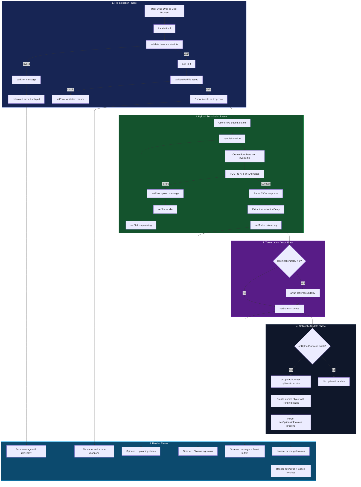

# Upload Data Flow

This document details the data lifecycle for invoice upload—from file selection through validation, API submission, tokenization, and optimistic rendering—within the LiquiFact Upload system (`/invoices` page).

**Related docs:**
- [`docs/upload-a11y.md`](upload-a11y.md) — accessibility contract for UploadZone
- [`README.md`](../README.md) — file upload security validation details

---

## Data Flow Diagram



---

## Textual / ASCII Flow Overview

Here is a simplified ASCII diagram detailing how data moves through the upload system:

```text
[ User Action: Drag-Drop or Click Browse ]
            │
            ▼
┌─────────────────────────────────────────────────────────────────┐
│  1. File Selection (UploadZone)                                 │
│                                                                  │
│  handleFile(f)                                                   │
│    ├─ validate(f): basic checks                                  │
│    │   ├─ File exists?                                           │
│    │   ├─ MIME type == application/pdf?                         │
│    │   ├─ Size <= 10MB?                                          │
│    │   └─ Size > 0 bytes?                                       │
│    │                                                             │
│    ├─ validatePdfFile(f): deep validation (async)               │
│    │   ├─ File extension == .pdf?                                │
│    │   ├─ Magic bytes == %PDF-? (FileReader)                    │
│    │   └─ Size == 0?                                             │
│    │                                                             │
│    └─ setFile(f) OR setError(reason)                             │
└─────────────────────────────────────────────────────────────────┘
           │
     ┌─────┴─────┐
     ▼           ▼
 [Valid]    [Invalid]
     │           │
     │           └─► setError(reason) ────► [ Render: role=alert error ]
     ▼
 [ Show file info in dropzone ]
     │
     ▼
┌─────────────────────────────────────────────────────────────────┐
│  2. Upload Submission (handleSubmit)                             │
│                                                                  │
│  User clicks Submit button                                       │
│    ├─ setStatus("uploading")                                    │
│    ├─ Create FormData with invoice file                         │
│    ├─ POST to API_URL/invoices                                   │
│    │                                                             │
│    └─ Response handling:                                         │
│        ├─ Success:                                               │
│        │   ├─ Parse JSON                                         │
│        │   ├─ Extract tokenizationDelay                          │
│        │   └─ setStatus("tokenizing")                            │
│        │                                                             │
│        └─ Failure:                                               │
│            ├─ setError(upload message)                           │
│            └─ setStatus("idle")                                  │
└─────────────────────────────────────────────────────────────────┘
           │
           ▼
┌─────────────────────────────────────────────────────────────────┐
│  3. Tokenization Delay                                          │
│                                                                  │
│  if tokenizationDelay > 0:                                       │
│    └─ await setTimeout(tokenizationDelay)                        │
│                                                                  │
│  setStatus("success")                                            │
└─────────────────────────────────────────────────────────────────┘
           │
           ▼
┌─────────────────────────────────────────────────────────────────┐
│  4. Optimistic Update (onUploadSuccess callback)                 │
│                                                                  │
│  if onUploadSuccess exists:                                      │
│    └─ Call with optimistic invoice object:                       │
│        {                                                          │
│          id: "upload-{timestamp}-{sanitizedName}",              │
│          issuer: sanitizedFilename(file.name),                  │
│          amount: "Pending",                                      │
│          currency: "USD",                                        │
│          dueDate: "Pending",                                     │
│          yield: "Pending",                                       │
│          status: "Pending tokenization"                          │
│        }                                                          │
│                                                                  │
│  Parent (app/invoices/page.js):                                  │
│    └─ setOptimisticInvoices([newInvoice, ...current])            │
└─────────────────────────────────────────────────────────────────┘
           │
           ▼
┌─────────────────────────────────────────────────────────────────┐
│  5. Render (InvoiceList)                                          │
│                                                                  │
│  mergeInvoices(optimisticInvoices, loadedInvoices)               │
│    ├─ Combine both arrays by ID                                   │
│    ├─ Optimistic invoices take precedence                        │
│    └─ Return merged array                                        │
│                                                                  │
│  Render merged invoice list                                      │
│    ├─ Show optimistic invoices with "Pending tokenization"       │
│    ├─ Show loaded invoices with actual status                    │
│    └─ Update aria-live status announcement                      │
└─────────────────────────────────────────────────────────────────┘
```

---

## Detailed Phases

### 1. File Selection Phase

The file selection sequence is managed by `UploadZone.jsx` through drag-and-drop and file input interactions.

**Trigger points:**
- **Drag-and-drop**: `onDrop` event handler captures `e.dataTransfer.files[0]`
- **Click browse**: `onClick` triggers hidden file input, `onChange` captures `e.target.files[0]`

**Validation pipeline:**

1. **Basic validation** (`validate` function - synchronous):
   - File existence check
   - MIME type verification (`application/pdf`)
   - Size constraint (≤ 10MB)
   - Non-empty file check (size > 0)

2. **Deep validation** (`validatePdfFile` - asynchronous, from `lib/validation/pdf.js`):
   - Extension check (case-insensitive `.pdf`)
   - Magic byte verification (`%PDF-` header via FileReader)
   - Zero-byte rejection
   - Content-extension mismatch detection

**Error handling:**
- Validation failures set `error` state and clear `file` state
- Errors render with `role="alert"` and `aria-live="assertive"` for screen readers
- User can retry by selecting a new file

### 2. Upload Submission Phase

When the user clicks the Submit button, `handleSubmit` orchestrates the API upload.

**State transitions:**
- Sets `status` to `"uploading"`
- Clears any existing errors
- Disables the submit button during processing

**API interaction:**
```javascript
const body = new FormData();
body.append("invoice", file);
const res = await fetch(`${API_URL}/invoices`, { method: "POST", body });
```

**Response handling:**
- **Success**: Parses JSON response, extracts `tokenizationDelay`, transitions to `"tokenizing"` status
- **Failure**: Sets error message from response or default, transitions back to `"idle"` status

**Progress indication:**
- If `progress` prop is provided (number 0-100), renders determinate progress bar
- Otherwise, renders indeterminate spinner with "Uploading invoice..." text

### 3. Tokenization Delay Phase

After successful upload, the component may wait for backend tokenization processing.

**Delay handling:**
```javascript
const { tokenizationDelay = 0 } = await res.json().catch(() => ({}));
if (tokenizationDelay > 0) {
  await new Promise((r) => setTimeout(r, tokenizationDelay));
}
```

**Purpose:**
- Allows backend time to process the invoice before marking as complete
- Simulates async tokenization workflow in production
- Zero delay skips waiting (immediate success)

**UI state:**
- Renders spinner with "Pending tokenization..." status
- Maintains disabled submit button
- Announces status via `role="status"` with `aria-live="polite"`

### 4. Optimistic Update Phase

Upon successful upload completion, the component optionally triggers an optimistic update.

**Callback invocation:**
```javascript
if (typeof onUploadSuccess === "function") {
  onUploadSuccess({
    id: `upload-${Date.now()}-${sanitizeFilename(file.name)}`,
    issuer: sanitizeFilename(file.name),
    amount: "Pending",
    currency: "USD",
    dueDate: "Pending",
    yield: "Pending",
    status: "Pending tokenization",
  });
}
```

**Optimistic invoice structure:**
- `id`: Unique identifier combining timestamp and sanitized filename
- `issuer`: Sanitized filename (HTML-escaped, truncated to 50 chars)
- `amount`, `currency`, `dueDate`, `yield`: Placeholder "Pending" values
- `status`: "Pending tokenization" to indicate backend processing

**Parent state update:**
- `app/invoices/page.js` receives callback
- Prepends optimistic invoice to `optimisticInvoices` array
- Triggers re-render of `InvoiceList` with new data

### 5. Render Phase

The final phase renders the updated invoice list with merged data.

**Data merging** (`InvoiceList.mergeInvoices`):
```javascript
function mergeInvoices(optimisticInvoices, loadedInvoices) {
  const mergedById = new Map();
  optimisticInvoices.forEach((invoice) => mergedById.set(invoice.id, invoice));
  loadedInvoices.forEach((invoice) => {
    if (!mergedById.has(invoice.id)) mergedById.set(invoice.id, invoice);
  });
  return Array.from(mergedById.values());
}
```

**Merge strategy:**
- Optimistic invoices take precedence (same ID would override loaded)
- Loaded invoices fill in gaps
- Maintains insertion order (optimistic first, then loaded)

**Accessibility announcements:**
- `role="status"` with `aria-live="polite"` announces list changes
- Status message: "N invoices available" or "No invoices are currently available"
- Updates on every load, optimistic add, and delete operation

**Visual rendering:**
- Optimistic invoices show "Pending tokenization" status badge (amber)
- Loaded invoices show actual status (tokenized, funded, settled)
- All invoices display: issuer, amount, currency, due date, yield, reference

---

## Data Shapes at Each Boundary

### 1. Raw File Object (Browser File API)

```javascript
{
  name: "invoice.pdf",
  type: "application/pdf",
  size: 1234567,  // bytes
  lastModified: 1234567890
}
```

### 2. Validated File State (UploadZone)

```javascript
{
  file: File,  // Original File object after validation
  error: null,  // No error if validation passed
  status: "idle"  // Ready for upload
}
```

### 3. API Request (FormData)

```javascript
FormData {
  invoice: File  // File object appended as "invoice" field
}
```

### 4. API Response (Backend)

```json
{
  "tokenizationDelay": 2000
}
```

### 5. Optimistic Invoice Object (onUploadSuccess)

```javascript
{
  id: "upload-1722345678900-invoice.pdf",
  issuer: "invoice.pdf",  // sanitized
  amount: "Pending",
  currency: "USD",
  dueDate: "Pending",
  yield: "Pending",
  status: "Pending tokenization"
}
```

### 6. Merged Invoice List (InvoiceList)

```javascript
[
  {
    id: "upload-1722345678900-invoice.pdf",
    issuer: "invoice.pdf",
    amount: "Pending",
    currency: "USD",
    dueDate: "Pending",
    yield: "Pending",
    status: "Pending tokenization"
  },
  {
    id: "inv-1001",
    issuer: "Test Supplier",
    amount: "12,500",
    currency: "USD",
    dueDate: "2026-06-15",
    yield: "8.2%",
    status: "Tokenized"
  }
]
```

---

## Security Considerations

The upload system implements multiple security layers:

1. **Client-side validation** (never trusts server data):
   - Magic byte verification prevents MIME spoofing
   - Extension validation ensures .pdf files only
   - Size limits prevent DoS (10MB max)
   - Zero-byte rejection blocks invalid files

2. **Filename sanitization** (`sanitizeFilename`):
   - HTML entity escaping prevents XSS
   - Length truncation (50 chars) prevents layout abuse
   - Applied before display in DOM

3. **Content Security Policy**:
   - `connect-src` restricts API endpoints
   - No inline script execution
   - Prevents data exfiltration

4. **Error handling**:
   - Never exposes raw server errors to users
   - Generic error messages for security
   - Detailed errors logged server-side only

---

## State Machine

UploadZone follows a strict state machine:

```
┌─────────┐
│  idle   │ ← Initial state, file selected but not submitted
└────┬────┘
     │ Submit clicked
     ▼
┌─────────────┐
│ uploading  │ ← File being sent to API
└────┬────┘
     │ API success
     ▼
┌───────────────┐
│ tokenizing   │ ← Waiting for tokenization delay
└────┬────┘
     │ Delay complete
     ▼
┌──────────┐
│ success  │ ← Upload complete, optimistic update sent
└────┬────┘
     │ Reset button clicked or new file selected
     ▼
┌─────────┐
│  idle   │ ← Back to initial state
└─────────┘

Error transitions (from any state):
┌─────────┐
│  error  │ ← Validation or upload failed
└────┬────┘
     │ New file selected or reset
     ▼
┌─────────┐
│  idle   │ ← Retry allowed
└─────────┘
```

---

## Testing Coverage

Tests for the upload data flow are located in:

- `components/UploadZone.test.jsx` — Core upload functionality
- `components/UploadZone.states.test.jsx` — State transitions
- `components/UploadZone.a11y-contract.test.jsx` — Accessibility contract
- `components/UploadZone.error-recovery.test.tsx` — Error handling
- `components/InvoiceList.test.tsx` — List rendering and merging
- `lib/validation/pdf.test.tsx` — PDF validation logic
- `components/UploadView.test.jsx` — Integration with parent component

**Key test scenarios:**
1. File selection and validation (valid/invalid PDFs)
2. Upload submission and API mocking
3. Tokenization delay handling
4. Optimistic invoice creation and merging
5. Error states and recovery
6. Accessibility announcements
7. State machine transitions
