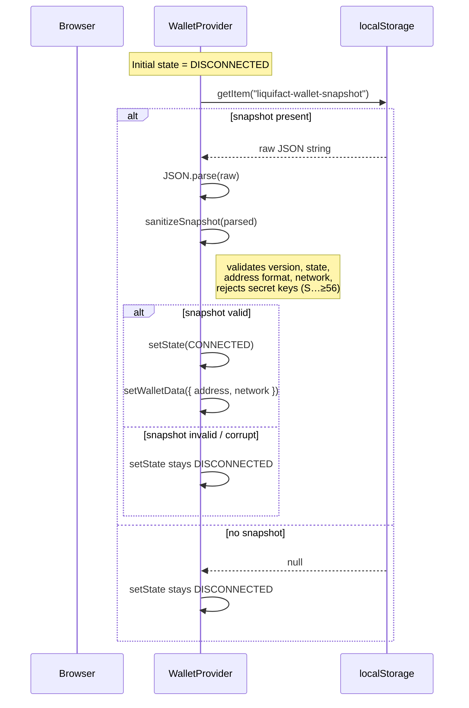
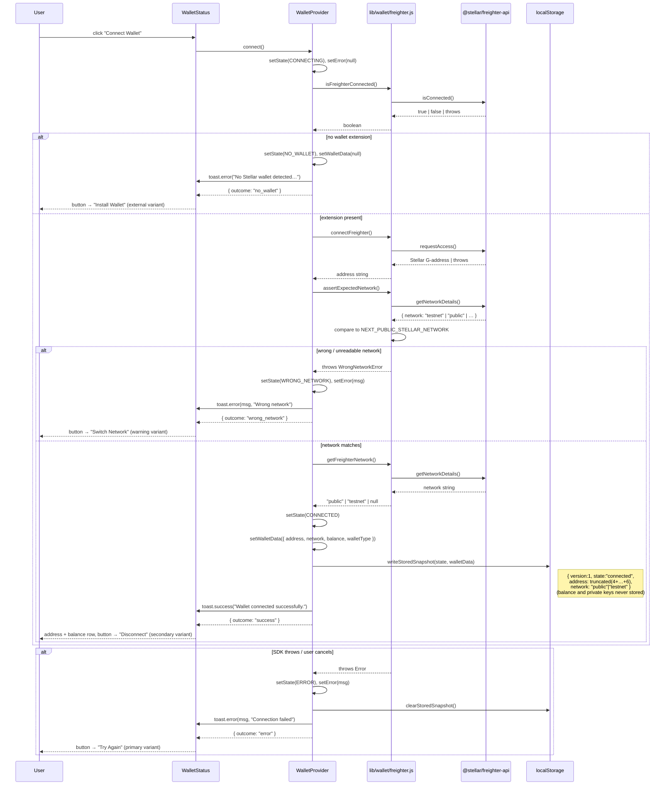
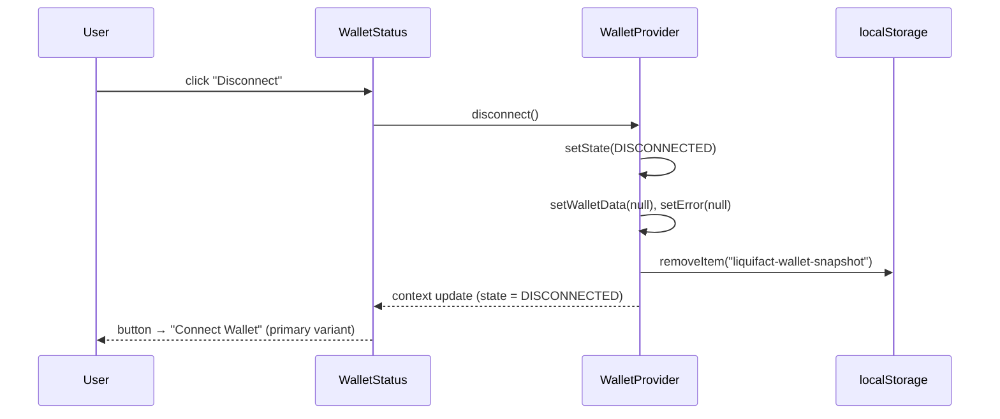

# Wallet Data Flow

Visual reference for how the wallet subsystem fetches, transforms, and renders
data. Covers the SSR → hydration lifecycle, the `connect()` path through the
Freighter SDK, and the localStorage persistence contract.

**Related docs:**
- [`docs/wallet-developer-guide.md`](wallet-developer-guide.md) — state machine reference and hook API
- [`../WALLET_INTEGRATION_CONTRACT.md`](../WALLET_INTEGRATION_CONTRACT.md) — adapter contract for real SDK wiring

---

## 1. Component hierarchy and rendering lifecycle

```
SSR (Node.js / Next.js)
│
├─ app/layout.js
│  ├─ <ToastProvider>
│  │  └─ <WalletProvider>        ← state initialised to DISCONNECTED (localStorage unreadable on server)
│  │     └─ {children}           ← page tree, NavMenu rendered per-page
│  └─ <Footer/>
│
└─ NavMenu (per-page, "use client")
   └─ <WalletStatusLazy>         ← next/dynamic({ ssr: false })
      └─ WalletStatusPlaceholder ← placeholder rendered on server & first client paint
                                    (aria-hidden, h-12 w-80, prevents CLS)

Client hydration (browser)
│
└─ WalletStatusLazy resolves its dynamic import
   └─ <WalletStatus>             ← real component mounts, calls useWallet()
      └─ reads WalletContext     ← provided by <WalletProvider>
```

`WalletStatusLazy` uses `ssr: false` because the Freighter SDK reads `window`
during initialisation. Rendering on the server would throw `window is not defined`
and ship unnecessary wallet code in the SSR bundle.

---

## 2. Startup / rehydration flow

When `WalletProvider` first **mounts in the browser** a single `useEffect` runs
and attempts to restore the previous session from `localStorage`:



The rehydration effect skips the persistence effect on its first run
(`skipPersistRef.current = true`) so restoring a snapshot does not immediately
re-write it.

---

## 3. Connect flow (fetch → transform → render)

Triggered when the user clicks **Connect Wallet** (or **Retry** / **Switch
Network**). `WalletProvider.connect()` never rejects — all error paths settle the
returned promise via `{ outcome }`.



---

## 4. Disconnect flow



---

## 5. Data shapes at each boundary

### 5a. Raw Freighter SDK output (`lib/wallet/freighter.js`)

| Function | Returns | Source API |
|---|---|---|
| `isFreighterConnected()` | `boolean` | `isConnected()` from `@stellar/freighter-api` |
| `connectFreighter()` | `string` — full Stellar G-address | `requestAccess()` |
| `getFreighterNetwork()` | `"public" \| "testnet" \| null` | `getNetworkDetails().network` (lowercased) |
| `assertExpectedNetwork()` | `void` or throws `WrongNetworkError` | `getNetworkDetails()` + env comparison |

### 5b. Transformed `walletData` stored in `WalletProvider` state

```js
{
  address: "GABC...XYZ123",   // truncated via truncateAddress() — first 4 + last 6 chars
  network: "public",           // "public" | "testnet"
  balance: "1,234.56 XLM",    // runtime-only, never persisted
  walletType: "freighter",     // adapter tag
}
```

### 5c. `localStorage` snapshot (`liquifact-wallet-snapshot`)

```json
{
  "version": 1,
  "state": "connected",
  "address": "GABC...XYZ123",
  "network": "testnet"
}
```

Fields **never** stored: `balance`, `walletType`, private keys, raw full address.
`sanitizeSnapshot()` rejects any value where `address` starts with `"S"` and is
≥ 56 characters long (Stellar secret key format).

### 5d. `useWallet()` context value (consumed by `WalletStatus` and any other client component)

```ts
{
  state: "disconnected" | "connecting" | "connected" | "error" | "wrong_network" | "no_wallet";
  walletData: { address: string; network: string; balance?: string } | null;
  error: string | null;
  connect: () => Promise<{ outcome: string; message?: string }>;
  disconnect: () => void;
}
```

---

## 6. `WalletStatus` render path (state → UI)

`getStateConfig(state, walletData, error)` maps the current state to Button
variant, label text, helper text, and whether to show the address row.

```
DISCONNECTED  → buttonVariant="primary"   label="Connect Wallet"   dot=slate
CONNECTING    → buttonVariant="primary"   label="Connecting…"      dot=yellow+pulse  loading=true (spinner)
CONNECTED     → buttonVariant="secondary" label="Disconnect"       dot=green         showAddress=true
ERROR         → buttonVariant="primary"   label="Try Again"        dot=red
WRONG_NETWORK → buttonVariant="warning"   label="Switch Network"   dot=red
NO_WALLET     → buttonVariant="external"  label="Install Wallet"   dot=slate
```

State transitions are announced once to screen readers via a `role="status"`
`aria-live="polite"` region. A separate `aria-label` on the button carries the
actionable copy; `aria-describedby` points to the `#wallet-helper-text` span
only when the address row is not rendered (to avoid dangling IDREF references).

---

## 7. ASCII summary (quick reference)

```
Browser                    WalletProvider              Freighter SDK / localStorage
──────                     ──────────────              ────────────────────────────
Page load (SSR)
  WalletStatusPlaceholder  ← renders (aria-hidden)
  [hydration]
  WalletStatus mounts ─────→ useWallet()
                             readStoredSnapshot()  ──→ localStorage.getItem(…)
                             sanitizeSnapshot()
                         ←── setState / setWalletData (or stays DISCONNECTED)

User: "Connect Wallet"
  WalletStatus.connect() ──→ connect()
                             setState(CONNECTING)
                             isFreighterConnected() ──→ isConnected()
                                                   ←── true
                             connectFreighter()     ──→ requestAccess()
                                                   ←── G-address
                             assertExpectedNetwork()──→ getNetworkDetails()
                                                   ←── { network: "testnet" }
                             getFreighterNetwork()  ──→ getNetworkDetails()
                                                   ←── "testnet"
                             setState(CONNECTED)
                             setWalletData(…)
                             writeStoredSnapshot()  ──→ localStorage.setItem(…)
                         ←── { outcome: "success" }
  WalletStatus renders address + Disconnect button

User: "Disconnect"
  WalletStatus.disconnect()→ disconnect()
                             setState(DISCONNECTED)
                             clearStoredSnapshot()  ──→ localStorage.removeItem(…)
                         ←── context update
  WalletStatus renders "Connect Wallet" button
```
